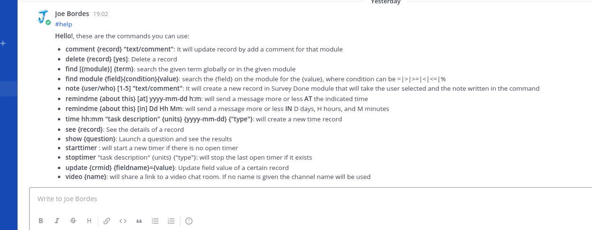
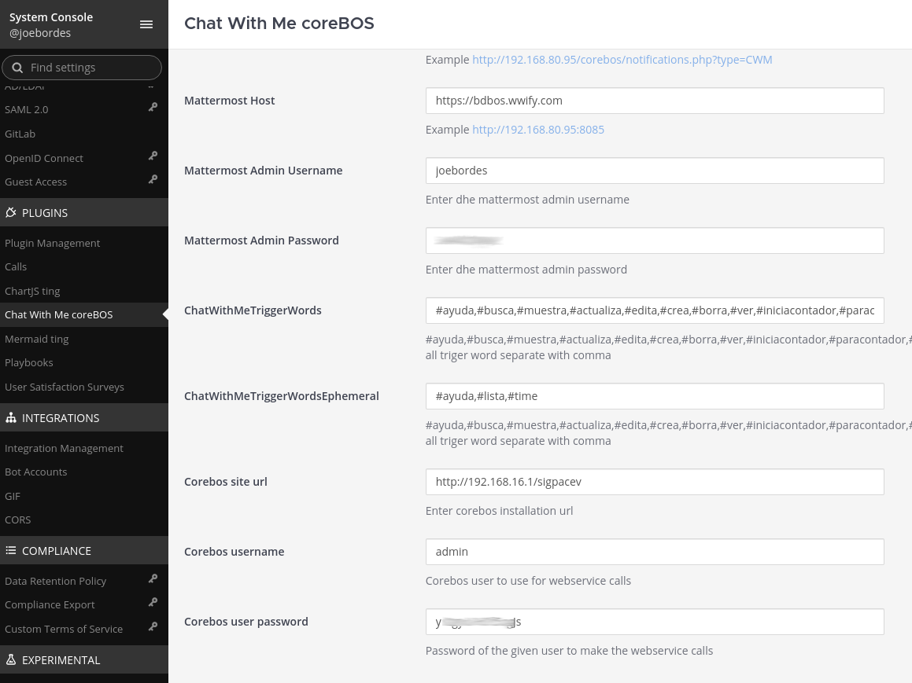
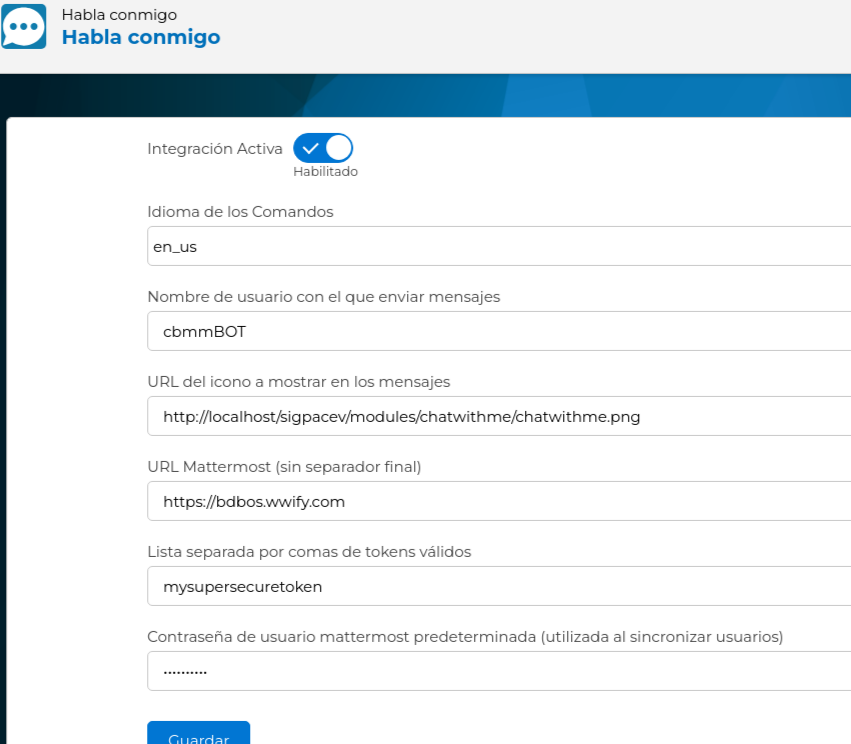

# ChatWithMe Extension

This extension permits us to connect coreBOS to an existing Mattermost installation and establish a bidirectional communication between both systems. We will be able to send messages using the workflow system on any of the supported events and we will be able to interact with our coreBOS information from within Mattermost.

To get a list of the features that are currently supported you can execute the `#help` command in any Mattermos channel. At the moment of writing this documentation this is what I get as a response:



## Installation and configuration

### Requirements

- up to date coreBOS application, optionally with Timecontrol module installed
- up to date Mattermost application

### System Setup

After installing the plugin in Mattermost and the `chatwithme` extension in coreBOS, configure both applications so they can communicate with each other.

1. Install the `chatwithme` extension in coreBOS. Either through the Module Manager or using the [Updater changeset](https://github.com/joebordes/chatwithme/blob/master/modules/chatwithme/changesets/installcwm.xml) you can find in modules/chatwithme/changesets/installcwm.xml.
2. Configure the coreBOS extension
   1. Access the extension at `index.php?action=index&module=chatwithme`
   2. **Integration Active**: Use the flag to enable or disable the plugin.
   3. **User name**: is just the name that will be shown in the messages sent from this coreBOS installation
   4. **Mattermost URL** (no trailing slash): Specify the server and port where Mattermost is running.
   5. **Comma-separated list of valid tokens**: Add a list of available tokens for authentication. This is a random security token. You can put any value you wish and change it whenever you want. This must match the settings in the Mattermost plugin to establish the communication.
   6. **Default Mattermost user password**: This is the password used when syncing users for the first time. Each user in coreBOS must be synced to their user in mattermost. This is done in the user's preferences page.
3. Configure the Mattermost extension
   1. Install the latest build of the ChatWithMe plugin in the Mattermost admin panel under **System Console** >> **Plugin Management** >> **Upload Plugin**. You can find this plugin at [mattermostcoreBOS](https://github.com/SpikeTings/mattermostcorebos) with instructions on how to build it.
   2. Once installed, go to the settings page, activate the plugin and fill in the fields
   3. The `ChatWithMeTriggerWords` filter accepted actions in this Mattermost installation. The normally supported values are: `#ayuda,#busca,#muestra,#actualiza,#edita,#crea,#borra,#ver,#iniciacontador,#paracontador,#registratiempo,#avisame,#lista,#help,#find,#show,#update,#edit,#create,#delete,#see,#starttimer,#stoptimer,#logtime,#remindme,#list,#task,#taskfortime,#taskforproject,#sbsavetime,#time`

The following images show an example configuration.





#### User Synchronization: Mattermost and coreBOS

Since Mattermost and coreBOS are separate applications running on different technologies, user synchronization between the two systems is necessary. For this purpose, Mattermost includes a `syncuser` service, which accepts requests from coreBOS. The following input parameters are required:

- Username
- Password
- Email
- FirstName
- LastName
- Role
- TeamName

The service returns a JSON object containing these input parameters and the Mattermost user ID.

coreBOS includes two new fields to facilitate user synchronization:

- **mmuserid**: Stores the Mattermost user ID.
- **MM Team (mmteam)**: Indicates the team to which the user will be added when sent to Mattermost. This field must be set manually.

A Business Action called **Sync with Mattermost** has been created in coreBOS and added to the Users preferences page. It reads values from the Users table and sends them to the Mattermost `syncuser` service. The response is then stored in the `mmuserid` field in the Users record.

If a user with the same email is found in the connected Mattermost installation, the user ID of that user will be returned, if no user is found a new user will be created in the assigned team and the user ID of the new user will be set for further communications.

#### Mattermost: Allow untrusted internal connections

This setting limits the ability of the Mattermost server to make untrusted requests within its local network. You may have to set this in your Mattermos installation. A request is considered untrusted if it's made on behalf of a client. The following features make untrusted requests and are affected by this setting:

- Integrations using webhooks, slash commands, or message actions (these are prevented from requesting endpoints within the local network).
- Link previews (prevents link previews for addresses within the local network).
- Local image proxy (prevents local network images from being used by integrations or posted in chats).

Requests that can only be configured by admins are considered trusted and are unaffected by this setting. Trusted URLs include those used for OAuth login or sending push notifications.

## Timecontrol

One of the main goals of the integration is to be able to easily create time control records. Each time record must be related to a project and a type of work. These two relations must be configured before we can create time control records.

The syntax of the command is:

`#time hh:mm "task description" {units} {yyyy-mm-dd} {"type"}`

According to the syntax, we have to type the keyword `time`, the amount of time that we actually worked, the task description, and then optionally we can put units, date and type of work.

Let's see how we can define the Project and types of work.

- first we must execute the [addCWM_TCFields](https://github.com/joebordes/chatwithme/blob/master/modules/chatwithme/changesets/addCWM_TCFields.php) changeset to add new fields to the application
- in the Project module, fill the Brand picklist with values from the company names stored in the Accounts module
- in the Project module, fill the Type picklist with project names the users will be working on
- in the Timecontrol module, fill the Brand and Related Concept picklists.
  - The Brand corresponds to the company name; copy paste the values of the homonymous field in Project module.
  - Related Concept corresponds to the Type picklist of the project; copy paste the values of the Type field in Project module.
- Create Business Maps for Timecontrol Type of Work values. There should be one map for each combination of Company, Project and Team.
  - The name of the Map should follow this syntax: `companyname-projectname-teamname`
    - companyname- is the name of the company that you have specified at the Organizations module (or the Brand picklist)
    - projectname- is the value that you have specified at the Type picklist at Projects.
    - teamname- is the name of MatterMost's team
  - for example

```xml
<map>
<originmodule>
<originname>Timecontrol</originname>
</originmodule>
  <fields>
  <field>
  <fieldname>typeofwork</fieldname>
  <features>
  <feature>
  <name>Terminology Check</name>
  <value>1</value>
  </feature>
   <feature>
  <name>Format Check</name>
  <value>2</value>
  </feature>
   <feature>
  <name>Spell Check</name>
  <value>3</value>
  </feature>
   <feature>
  <name>Variant Check</name>
  <value>4</value>
  </feature>
      </features>
    </field>
  </fields>
</map>
```

- in the Timecontrol module, fill the Type of Work picklist with the list of the activities that the user has to insert TC, specified in the BusinessMap
- In MatterMost, create a new channel. The channel in MatterMost should be identical in name to the project that you are trying to create in coreBOS. Hereby, the channel's name should follow the following syntax: `companyname-projectname`

**NOTE**: The project for which this timecontrol is created, shall be created automatically in CoreBOS, by receiving the necessary data from MatterMost's channel.

**NOTE**: Users should have access to the Accounts, Projects, Timecontrol modules in order to be able to insert new Timecontrol records from the Mattermost application. After completing these steps, you should have setup both applications and they should be working correctly, by handling the requests from all users.